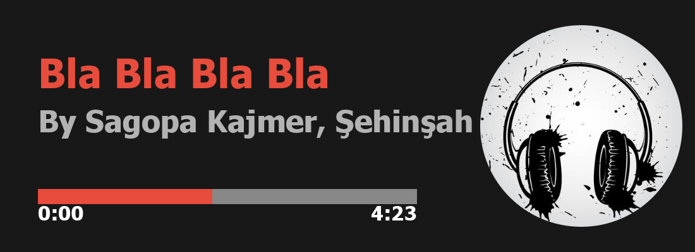

# musicard

Generate beautiful music cards for Discord bots and more! Supports multiple styles: classic, classic-adv, dynamic, and more.

## Features
- Multiple card styles (classic, classic-adv, dynamic)
- Customizable (theme, rounded corners, accent color, platform icon)
- Perfect for Discord bots and music projects

## Install
```sh
npm install musicard
```

## Usage
```js
const { generateClassicCard, generateClassicAdvCard, generateDynamicCard } = require('musicard');
const fs = require('fs');

const buffer = await generateClassicCard({
  title: 'Bla Bla Bla Bla',
  artist: 'Sagopa Kajmer, Şehinşah',
  album: 'Kağıt Kesikleri',
  cover: 'cover.jpg',
  progress: 121,
  duration: 263,
}, { theme: 'dark', rounded: true, platform: 'spotify' });

fs.writeFileSync('card.png', buffer);
```

## Example Cards

| Classic | Classic-Adv | Dynamic |
| ------- | ----------- | ------- |
|  |  |  |

## License
MIT 